# Architecture

## Process Model & Layers

`code-space-api` is structured into four explicit runtime layers:

```
[HTTP Requests]
      │
      ▼
┌───────────┐    1. Router & Middleware (Helmet, Rate Limiter, CORS, JWT Auth)
│ Router    │
└─────┬─────┘
      │
      ▼
┌───────────┐    2. Controller Layer (Parses input, validates Zod DTOs)
│ Controller│
└─────┬─────┘
      │
      ▼
┌───────────┐    3. Service Layer (Business logic, password verification, transactions)
│  Service  │
└─────┬─────┘
      │
      ▼
┌───────────┐    4. Data Layer (Prisma ORM Client -> MySQL 8.0)
│ Prisma DB │
└───────────┘
```

## System Class Diagram

```mermaid
classDiagram
    class AuthController {
        +register(req, res, next)
        +login(req, res, next)
        +refresh(req, res, next)
        +logout(req, res, next)
        +getMe(req, res, next)
    }

    class SettingsController {
        +getSettings(req, res, next)
        +updateSettings(req, res, next)
    }

    class PresetController {
        +getPresets(req, res, next)
        +createPreset(req, res, next)
        +updatePreset(req, res, next)
        +deletePreset(req, res, next)
    }

    class SyncController {
        +pushSync(req, res, next)
        +pullSync(req, res, next)
    }

    class AuthService {
        -prisma: PrismaClient
        +registerUser(data: RegisterUserDto) UserResponseDto
        +authenticateUser(credentials: LoginUserDto) TokenPairDto
        +refreshSession(refreshToken: string) TokenPairDto
        +revokeSession(refreshToken: string) void
    }

    class SettingsService {
        -prisma: PrismaClient
        +getUserSettings(userId: bigint) UserSettingsDto
        +updateUserSettings(userId: bigint, patch: UpdateSettingsDto) UserSettingsDto
    }

    class PresetService {
        -prisma: PrismaClient
        +listPresets(userId: bigint) PresetDto[]
        +createPreset(userId: bigint, dto: CreatePresetDto) PresetDto
        +deletePreset(userId: bigint, presetId: string) void
    }

    class SyncService {
        -prisma: PrismaClient
        +processPushSync(userId: bigint, syncPayload: SyncPushDto) SyncResultDto
        +generatePullSync(userId: bigint) SyncPullDto
    }

    class PrismaClient {
        +user
        +refreshToken
        +userSettings
        +workspacePreset
        +presetTerminal
        +cliTool
        +customSound
        +$transaction(actions)
    }

    class AuthMiddleware {
        +authenticateJwt(req, res, next)
        +requireRole(role)
    }

    class AppError {
        +statusCode: number
        +errorCode: string
        +isOperational: boolean
        +constructor(message, statusCode, errorCode)
    }

    class ValidationError {
        +errors: ZodIssue[]
    }

    AuthController --> AuthService : delegates to
    SettingsController --> SettingsService : delegates to
    PresetController --> PresetService : delegates to
    SyncController --> SyncService : delegates to

    AuthService --> PrismaClient : queries DB via
    SettingsService --> PrismaClient : queries DB via
    PresetService --> PrismaClient : queries DB via
    SyncService --> PrismaClient : queries DB via

    AppError <|-- ValidationError : inherits
    AuthController ..> AuthMiddleware : protected by
    SettingsController ..> AuthMiddleware : protected by
    PresetController ..> AuthMiddleware : protected by
    SyncController ..> AuthMiddleware : protected by
```



## Responsibilities

### Middleware Layer

- Enforce Helmet security headers and CORS whitelisting.
- Rate-limit endpoint access by IP address.
- Verify JWT Access Tokens (`Bearer <token>`) and attach `req.user` context.
- Validate request bodies, params, and queries using Zod schemas.
- Catch uncaught exceptions in global error handler.

### Controller Layer

- Unpack HTTP request inputs (`req.body`, `req.params`, `req.query`, `req.user`).
- Delegate domain tasks to corresponding services.
- Return standardized JSON response envelopes (`status`, `data`, `message`).

### Service Layer

- Execute business logic (password hashing via Argon2id, token issuance, preset merging).
- Wrap multi-table database operations inside Prisma `$transaction()`.

### Prisma Data Layer

- Abstract MySQL 8.0 queries using type-safe Prisma models.
- Enforce relational user scoping (`where: { userId }`).

---

## Security Model

### Argon2id Hashing

Passwords are encrypted using Argon2id with OWASP parameters:

- Memory: `64 MB` (`65536` KB)
- Time cost: `3` iterations
- Parallelism: `4` threads

### Dual JWT Token Pattern

- **Access Token**: Short-lived (`15m`), passed via `Authorization: Bearer <token>`.
- **Refresh Token**: Long-lived (`7d`), passed via HTTP-only cookie, stored hashed in `refresh_tokens` database table. Token rotated on every refresh.

---

## Response & Error Format

### Success Response (`HTTP 200 / 201`)

```json
{
  "status": "success",
  "data": { ... },
  "message": "Operation completed successfully"
}
```

### Error Response (`HTTP 4xx / 5xx`)

```json
{
  "status": "error",
  "error": {
    "code": "RESOURCE_NOT_FOUND",
    "message": "Requested preset was not found"
  }
}
```
