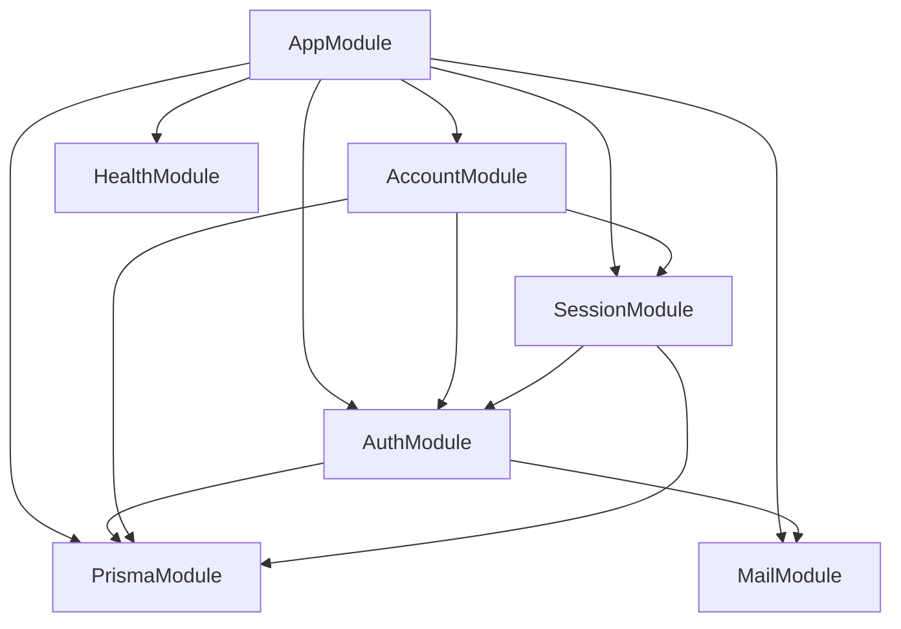
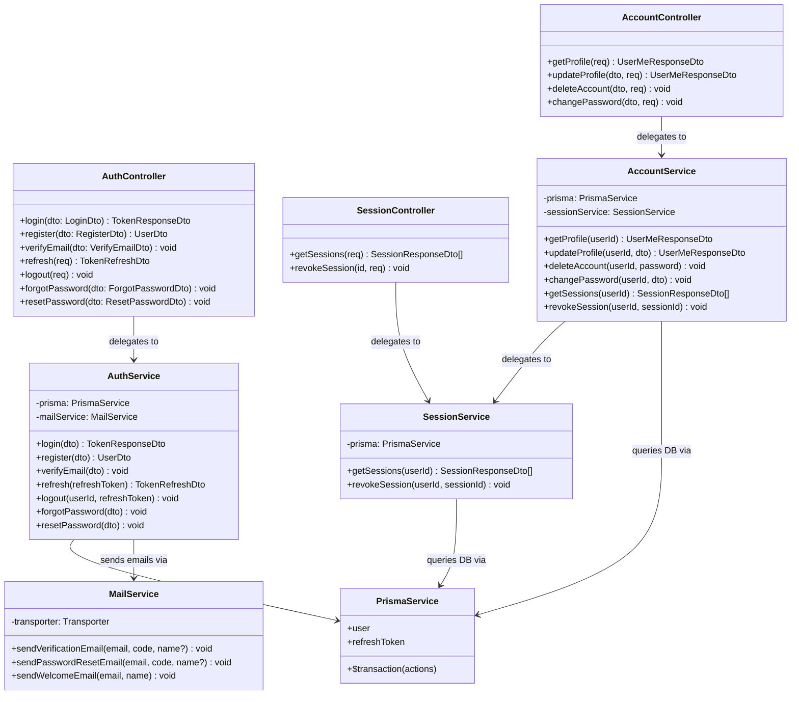

# Architecture

## Process Model & Layers

`code-space-api` is structured into four explicit runtime layers:

```
[HTTP Requests]
      │
      ▼
┌───────────┐    1. Router & Guards (Helmet, Rate Limiter, CORS, JWT Auth, ThrottlerGuard)
│  Guards   │
└─────┬─────┘
      │
      ▼
┌───────────┐    2. Controller Layer (Parses input, validates class-validator DTOs)
│ Controller│
└─────┬─────┘
      │
      ▼
┌───────────┐    3. Service Layer (Business logic, password verification, transactions)
│  Service  │
└─────┬─────┘
      │
      ▼
┌───────────┐    4. Data Layer (Prisma ORM Client → MySQL 8.0)
│ Prisma DB │
└───────────┘
```

## Module Dependency Graph



## System Class Diagram



## Responsibilities

### Guard Layer

- Enforce Helmet security headers and CORS whitelisting.
- Rate-limit endpoint access by IP address via `@nestjs/throttler`.
- Verify JWT Access Tokens (`Authorization: Bearer <token>`) and attach `req.user` via `JwtAuthGuard`.
- Validate request bodies, params, and queries using `class-validator` DTOs.
- Catch uncaught exceptions in global `HttpExceptionFilter`.

### Controller Layer

- Unpack HTTP request inputs (`@Body()`, `@Param()`, `@Query()`, `@Req()`).
- Delegate domain tasks to corresponding services.
- Return data that the global `ResponseInterceptor` wraps in a standardized JSON response envelope (`status`, `data`, `message`, `meta`).

### Service Layer

- Execute business logic (Argon2id password hashing/verification, JWT token issuance/rotation, OTP generation).
- Wrap multi-table database operations inside Prisma `$transaction()`.
- Dispatch transactional emails asynchronously in the background.

### Prisma Data Layer

- Abstract MySQL 8.0 queries using type-safe Prisma models.
- Enforce relational user scoping (`where: { userId }`).
- Serialize `BigInt` primary keys to `string` in all response DTOs.

---

## Security Model

### Argon2id Hashing

Passwords are encrypted using Argon2id with OWASP parameters:

- Memory: `64 MB` (`65536` KB)
- Time cost: `3` iterations
- Parallelism: `4` threads

### Password Strength Requirements

All password fields enforce the following minimum requirements (aligned with the desktop client schema):

- **Minimum length**: 6 characters
- **Must contain**: at least one uppercase letter (`[A-Z]`), one lowercase letter (`[a-z]`), and one digit (`[0-9]`)

### Dual JWT Token Pattern

- **Access Token**: Short-lived (`15m`), passed via `Authorization: Bearer <token>`.
- **Refresh Token**: Long-lived (`7d`), passed via HTTP-only cookie, stored hashed in the `refresh_tokens` database table. Token is rotated on every refresh.

### Session IDOR Protection

All session revocation queries are scoped to both `sessionId` AND `userId` from the JWT, preventing users from revoking other users' sessions.

---

## Response & Error Format

### Success Response (`HTTP 200 / 201`)

The global `ResponseInterceptor` automatically wraps all controller return values:

```json
{
  "status": "success",
  "data": { ... },
  "message": "Login successfully",
  "meta": {
    "timestamp": 1785568167359,
    "version": "v1",
    "path": "/api/v1/auth/login"
  }
}
```

> `message` is set via `@ResponseMessage('...')` on each controller handler. If the decorator is absent, the field is omitted from the response.

### Error Response (`HTTP 4xx / 5xx`)

The global `HttpExceptionFilter` formats all thrown `HttpException` instances:

```json
{
  "status": "error",
  "code": "INVALID_CREDENTIALS",
  "message": "Invalid email or password",
  "meta": {
    "timestamp": 1785568167359,
    "path": "/api/v1/auth/login"
  }
}
```

---

## Email Architecture

### Inline Brand Logo (CID Attachment)

To avoid Gmail's 102 KB HTML clipping limit, the `logo.png` brand asset is:

1. **Stored at**: `src/assets/images/logo.png` (18 KB, 96×96 RGBA PNG)
2. **Copied to**: `dist/assets/images/logo.png` on build (via `nest-cli.json` assets)
3. **Attached** as a Nodemailer CID inline attachment (`cid: 'logo@codespace.dev'`)
4. **Referenced** in HTML templates as ``

This keeps the raw HTML body at ~3 KB, well under Gmail's threshold.

### Async Background Dispatch

Email sending is dispatched asynchronously from `AuthService` to avoid blocking HTTP response:

```typescript
void this.mailService
  .sendVerificationEmail(email, code, name)
  .catch((err) => this.logger.error(`Failed to send verification email: ${err.message}`));
```
