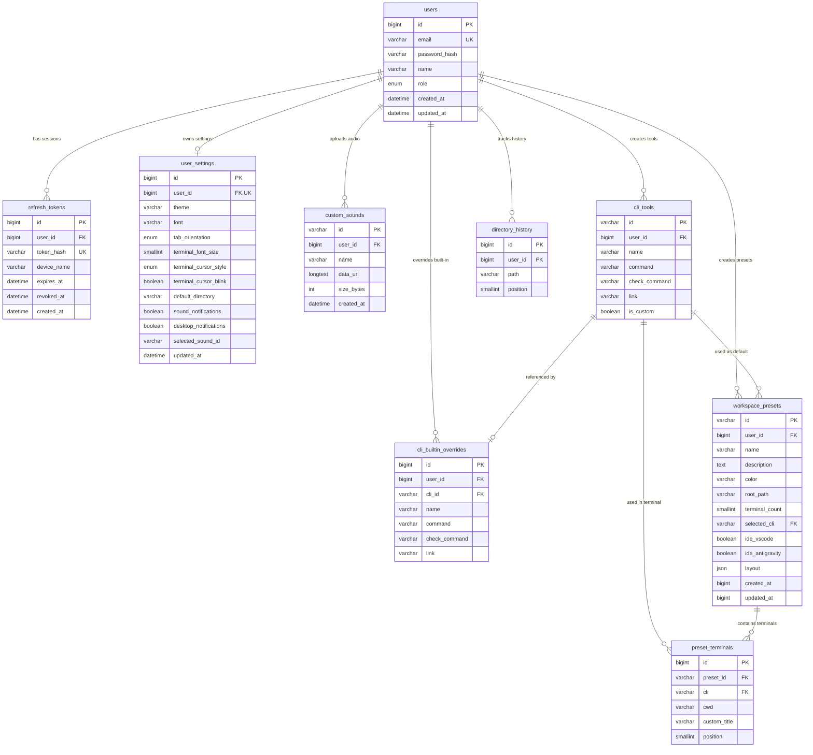

# Database — Prisma ORM & MySQL 8.0

## Overview

`code-space-api` uses **Prisma ORM (v6.x)** connected to a **MySQL 8.0** relational database. It stores user accounts, settings, workspace presets, sub-terminals, custom CLI tools, custom notification sounds, directory history, and cloud sync logs.

---

## Relational Database Diagram (ERD)



---

## Core Prisma Schema (`prisma/schema.prisma`)

```prisma
generator client {
  provider = "prisma-client-js"
}

datasource db {
  provider = "mysql"
  url      = env("DATABASE_URL")
}

enum UserRole {
  USER
  ADMIN
}

enum TabOrientation {
  horizontal
  vertical
}

enum TerminalCursorStyle {
  block
  underline
  bar
}

model User {
  id           BigInt   @id @default(autoincrement()) @db.UnsignedBigInt
  email        String   @unique @db.VarChar(255)
  passwordHash String   @map("password_hash") @db.VarChar(255)
  name         String   @db.VarChar(255)
  role         UserRole @default(USER)
  createdAt    DateTime @default(now()) @map("created_at") @db.DateTime(3)
  updatedAt    DateTime @updatedAt @map("updated_at") @db.DateTime(3)

  refreshTokens       RefreshToken[]
  settings            UserSettings?
  customSounds        CustomSound[]
  cliTools            CliTool[]
  cliBuiltinOverrides CliBuiltinOverride[]
  workspacePresets    WorkspacePreset[]
  directoryHistories  DirectoryHistory[]

  @@map("users")
}

model RefreshToken {
  id         BigInt    @id @default(autoincrement()) @db.UnsignedBigInt
  userId     BigInt    @map("user_id") @db.UnsignedBigInt
  tokenHash  String    @unique @map("token_hash") @db.VarChar(255)
  deviceName String?   @map("device_name") @db.VarChar(255)
  expiresAt  DateTime  @map("expires_at") @db.DateTime(3)
  revokedAt  DateTime? @map("revoked_at") @db.DateTime(3)
  createdAt  DateTime  @default(now()) @map("created_at") @db.DateTime(3)

  user User @relation(fields: [userId], references: [id], onDelete: Cascade)

  @@index([userId], map: "idx_refresh_tokens_user_id")
  @@map("refresh_tokens")
}

model UserSettings {
  id                   BigInt              @id @default(autoincrement()) @db.UnsignedBigInt
  userId               BigInt              @unique @map("user_id") @db.UnsignedBigInt
  theme                String              @default("cyberpunk") @db.VarChar(64)
  font                 String              @default("inter") @db.VarChar(64)
  tabOrientation       TabOrientation      @default(horizontal) @map("tab_orientation")
  terminalFontSize     Int                 @default(14) @map("terminal_font_size") @db.UnsignedSmallInt
  terminalCursorStyle  TerminalCursorStyle @default(block) @map("terminal_cursor_style")
  terminalCursorBlink  Boolean             @default(true) @map("terminal_cursor_blink")
  defaultDirectory     String              @default("") @map("default_directory") @db.VarChar(1024)
  soundNotifications   Boolean             @default(true) @map("sound_notifications")
  desktopNotifications Boolean             @default(true) @map("desktop_notifications")
  selectedSoundId      String              @default("default") @map("selected_sound_id") @db.VarChar(128)
  updatedAt            DateTime            @updatedAt @map("updated_at") @db.DateTime(3)

  user User @relation(fields: [userId], references: [id], onDelete: Cascade)

  @@map("user_settings")
}

model CustomSound {
  id        String   @id @db.VarChar(128)
  userId    BigInt   @map("user_id") @db.UnsignedBigInt
  name      String   @db.VarChar(255)
  dataUrl   String   @map("data_url") @db.LongText
  sizeBytes Int      @default(0) @map("size_bytes") @db.UnsignedInt
  createdAt DateTime @default(now()) @map("created_at") @db.DateTime(3)

  user User @relation(fields: [userId], references: [id], onDelete: Cascade)

  @@index([userId], map: "idx_custom_sounds_user_id")
  @@map("custom_sounds")
}

model CliTool {
  id           String   @id @db.VarChar(128)
  userId       BigInt?  @map("user_id") @db.UnsignedBigInt
  name         String   @db.VarChar(255)
  command      String   @db.VarChar(512)
  checkCommand String?  @map("check_command") @db.VarChar(512)
  link         String?  @db.VarChar(2048)
  isCustom     Boolean  @default(false) @map("is_custom")

  user                  User?                @relation(fields: [userId], references: [id], onDelete: Cascade)
  overrides             CliBuiltinOverride[]
  presetsAsDefault      WorkspacePreset[]
  presetTerminalsAsCli PresetTerminal[]

  @@map("cli_tools")
}

model CliBuiltinOverride {
  id           BigInt   @id @default(autoincrement()) @db.UnsignedBigInt
  userId       BigInt   @map("user_id") @db.UnsignedBigInt
  cliId        String   @map("cli_id") @db.VarChar(128)
  name         String?  @db.VarChar(255)
  command      String?  @db.VarChar(512)
  checkCommand String?  @map("check_command") @db.VarChar(512)
  link         String?  @db.VarChar(2048)

  user    User    @relation(fields: [userId], references: [id], onDelete: Cascade)
  cliTool CliTool @relation(fields: [cliId], references: [id], onDelete: Cascade)

  @@unique([userId, cliId], map: "uq_user_cli_override")
  @@map("cli_builtin_overrides")
}

model WorkspacePreset {
  id             String   @id @db.VarChar(128)
  userId         BigInt   @map("user_id") @db.UnsignedBigInt
  name           String   @db.VarChar(255)
  description    String   @default("") @db.Text
  color          String   @default("#6366f1") @db.VarChar(7)
  rootPath       String   @map("root_path") @db.VarChar(1024)
  terminalCount  Int      @default(1) @map("terminal_count") @db.UnsignedSmallInt
  selectedCli    String?  @map("selected_cli") @db.VarChar(128)
  ideVscode      Boolean  @default(false) @map("ide_vscode")
  ideAntigravity Boolean  @default(false) @map("ide_antigravity")
  layout         Json?    @db.Json
  createdAt      BigInt   @map("created_at") @db.UnsignedBigInt
  updatedAt      BigInt   @map("updated_at") @db.UnsignedBigInt

  user       User             @relation(fields: [userId], references: [id], onDelete: Cascade)
  defaultCli CliTool?         @relation(fields: [selectedCli], references: [id], onDelete: SetNull)
  terminals  PresetTerminal[]

  @@index([userId], map: "idx_workspace_presets_user_id")
  @@map("workspace_presets")
}

model PresetTerminal {
  id          BigInt  @id @default(autoincrement()) @db.UnsignedBigInt
  presetId    String  @map("preset_id") @db.VarChar(128)
  cli         String? @db.VarChar(128)
  cwd         String  @db.VarChar(1024)
  customTitle String? @map("custom_title") @db.VarChar(255)
  position    Int     @default(0) @db.UnsignedSmallInt

  preset  WorkspacePreset @relation(fields: [presetId], references: [id], onDelete: Cascade)
  cliTool CliTool?         @relation(fields: [cli], references: [id], onDelete: SetNull)

  @@index([presetId], map: "idx_preset_terminals_preset_id")
  @@map("preset_terminals")
}

model DirectoryHistory {
  id       BigInt @id @default(autoincrement()) @db.UnsignedBigInt
  userId   BigInt @map("user_id") @db.UnsignedBigInt
  path     String @db.VarChar(1024)
  position Int    @default(0) @db.UnsignedSmallInt

  user User @relation(fields: [userId], references: [id], onDelete: Cascade)

  @@unique([userId, path], map: "uq_user_directory_path")
  @@map("directory_history")
}
```
